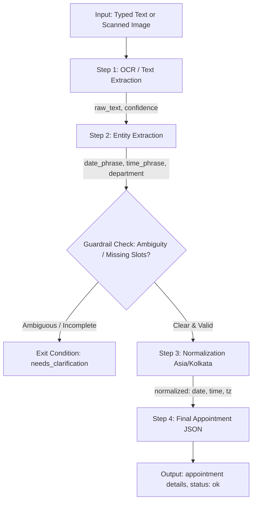

# Plum AI-Powered Appointment Scheduler Assistant

> **Plum SDE Intern Assignment — Problem Statement 1**  
> **Focus Area:** OCR &rarr; Entity Extraction &rarr; Normalization (Asia/Kolkata) &rarr; Guardrails &rarr; Final Appointment JSON

[](https://www.python.org/downloads/)
[](https://fastapi.tiangolo.com)
[](https://docs.pytest.org/)
[](LICENSE)

---

## 📋 Table of Contents
1. [Overview & Problem Statement Selection](#-overview--problem-statement-selection)
2. [Architecture & Pipeline Workflow](#-architecture--pipeline-workflow)
3. [Key Features & Guardrails](#-key-features--guardrails)
4. [Project Structure](#-project-structure)
5. [Quickstart & Installation](#-quickstart--installation)
6. [Running the Interactive Web UI & API Docs](#-running-the-interactive-web-ui--api-docs)
7. [API Reference & Sample cURL Requests](#-api-reference--sample-curl-requests)
8. [Automated Testing](#-automated-testing)
9. [Public Demo with Ngrok](#-public-demo-with-ngrok)
10. [Screen Recording Walkthrough Guide](#-screen-recording-walkthrough-guide)

---

## 🎯 Overview & Problem Statement Selection

### Selection Rationale
Among the 4 assignment options, **Problem Statement 1 (AI-Powered Appointment Scheduler Assistant)** was chosen as the most compelling and strategically aligned project:
1. **Core Plum Business Domain**: Plum provides comprehensive health insurance, OPD benefits, and telehealth/doctor consultations. Booking appointments with dentists, physicians, and specialists is the primary interactive user journey.
2. **End-to-End Multimodal Engineering**: The pipeline takes natural language typed text or noisy, photographed prescription/doctor notes, performs OCR noise reduction and typo correction, extracts clinical entities, anchors calendar arithmetic to `Asia/Kolkata` timezone, validates ambiguity guardrails, and emits structured booking JSON.
3. **Exact Adherence to JSON Schemas**: Every step strictly adheres to the schema contracts specified in the assignment PDF.

---

## 🏗️ Architecture & Pipeline Workflow



### Pipeline Steps:

| Step | Component | Focus | Input Sample | Output Sample |
|------|-----------|-------|--------------|---------------|
| **1** | **OCR / Text Extraction** | Image preprocessing, RapidOCR, typo fixes (`nxt` &rarr; `next`, `@` &rarr; `at`) | `book dentist nxt Friday @ 3 pm` | `{"raw_text": "Book dentist next Friday at 3pm", "confidence": 0.90}` |
| **2** | **Entity Extraction** | Extract date/time phrases and department | `Book dentist next Friday at 3pm` | `{"entities": {"date_phrase": "next Friday", "time_phrase": "3pm", "department": "dentist"}, "entities_confidence": 0.85}` |
| **3** | **Normalization** | Calendar math relative to reference date, 24-hr time, `Asia/Kolkata` timezone | Entities + Reference Date `2025-09-19` | `{"normalized": {"date": "2025-09-26", "time": "15:00", "tz": "Asia/Kolkata"}, "normalization_confidence": 0.90}` |
| **G** | **Guardrails** | Ambiguity & incomplete slot handling | `"Doctor appointment sometime next week"` | `{"status": "needs_clarification", "message": "Ambiguous date/time or department"}` |
| **4** | **Final Appointment** | Taxonomy standardization & status confirmation | Entities + Normalized values | `{"appointment": {"department": "Dentistry", "date": "2025-09-26", "time": "15:00", "tz": "Asia/Kolkata"}, "status": "ok"}` |

---

## 🛡️ Key Features & Guardrails

- **Self-Contained & Deterministic**: Incorporates an offline high-performance OCR engine (`rapidocr-onnxruntime` + `Pillow`) and rule-based NLP engine. It runs 100% locally with zero required external API keys.
- **Multimodal AI Fallback**: If `GEMINI_API_KEY` is provided in `.env`, it can seamlessly leverage Gemini 2.5 Flash for vision and complex clinical entity disambiguation.
- **Strict Timezone Handling**: All temporal expressions ("next Friday", "tomorrow at 10am") are strictly anchored to India Standard Time (`Asia/Kolkata`).
- **Defensive Guardrails**:
  - Missing time slot (e.g., "Schedule dental checkup this Friday").
  - Vague dates (e.g., "sometime next week", "later").
  - Missing medical specialty/department.
  - Past dates relative to reference date.
  - Returns exact PDF exit condition: `{"status": "needs_clarification", "message": "Ambiguous date/time or department"}`.

---

## 📁 Project Structure

```
├── app/
│   ├── __init__.py
│   ├── main.py                     # FastAPI application entrypoint & docs
│   ├── config.py                   # App settings, timezone, & department taxonomy
│   ├── schemas.py                  # Pydantic schemas strictly matching PDF contracts
│   ├── api/
│   │   ├── __init__.py
│   │   └── routes.py               # Step 1, Step 2, Step 3, Step 4 & Orchestrated endpoints
│   └── services/
│       ├── __init__.py
│       ├── ocr_service.py          # Step 1: Image preprocessing, OCR & typo cleaning
│       ├── entity_service.py       # Step 2: Entity extraction (date, time, dept)
│       ├── normalization_service.py# Step 3: Asia/Kolkata date/time & taxonomy normalizer
│       ├── guardrail_service.py    # Ambiguity check & exit conditions
│       └── pipeline_orchestrator.py# End-to-end chained pipeline coordinator
├── static/
│   └── index.html                  # Interactive Plum Web UI Playground
├── sample_inputs/
│   ├── clean_appointment_note.png  # Test image: "Book dentist next Friday at 3pm"
│   ├── noisy_ocr_sample.png        # Test image: "book dentist nxt Friday @ 3 pm"
│   ├── cardiology_consult.png      # Test image: "Cardiology checkup tomorrow at 10:30am"
│   └── ambiguous_appointment.png   # Test image: "Doctor appointment sometime next week"
├── scripts/
│   ├── generate_samples.py         # Generates test images
│   ├── demo_guide.py               # Live terminal demo script
│   ├── test_endpoints.sh           # Bash cURL test script
│   └── test_endpoints.ps1          # PowerShell test script
├── tests/
│   ├── __init__.py
│   └── test_pipeline.py            # 16 automated pytest unit & integration tests
├── plum_appointment_scheduler.postman_collection.json # Postman collection
├── requirements.txt                # Pinned dependencies
└── README.md                       # Documentation
```

---

## 🚀 Quickstart & Installation

### 1. Prerequisites
- Python 3.10, 3.11, or 3.12 installed.

### 2. Clone Repository & Setup Virtual Environment
```bash
git clone <your-repo-url>
cd "Plum Benefits Private Limited Assignment"

# Create virtual environment
python -m venv venv

# Activate virtual environment
# Windows:
.\venv\Scripts\activate
# Linux / macOS:
source venv/bin/activate

# Install dependencies
pip install -r requirements.txt
```

### 3. Generate Sample Test Images
```bash
python scripts/generate_samples.py
```

### 4. Start the Backend Server
```bash
python -m uvicorn app.main:app --host 0.0.0.0 --port 8000 --reload
```
The server will start at `http://127.0.0.1:8000`.

---

## 💻 Running the Interactive Web UI & API Docs

### 1. Interactive Demo Playground
Open your browser and navigate to:
👉 **[http://127.0.0.1:8000/](http://127.0.0.1:8000/)**

**Features:**
- Quick-fill buttons for all assignment sample cases (Clean text, Noisy OCR, Guardrail triggers).
- File upload for scanned images with drag-and-drop.
- Real-time step-by-step pipeline cards showing confidence scores, extracted entities, and normalization details.
- JSON response viewer with one-click copy to clipboard.

### 2. Swagger / OpenAPI Documentation
Interactive OpenAPI documentation is available at:
👉 **[http://127.0.0.1:8000/docs](http://127.0.0.1:8000/docs)**

---

## 📡 API Reference & Sample cURL Requests

### Step 1: OCR / Text Extraction (`POST /api/v1/extract-text`)
Extracts and cleans raw text from typed input or scanned note.

**cURL (Typed Text):**
```bash
curl -X POST "http://127.0.0.1:8000/api/v1/extract-text" \
  -H "Content-Type: application/json" \
  -d '{"text": "book dentist nxt Friday @ 3 pm"}'
```
**Response:**
```json
{
  "raw_text": "Book dentist next Friday at 3pm",
  "confidence": 0.90
}
```

**cURL (Image File Upload):**
```bash
curl -X POST "http://127.0.0.1:8000/api/v1/extract-text" \
  -F "image=@sample_inputs/clean_appointment_note.png"
```

---

### Step 2: Entity Extraction (`POST /api/v1/extract-entities`)
Extracts `date_phrase`, `time_phrase`, and `department`.

**cURL:**
```bash
curl -X POST "http://127.0.0.1:8000/api/v1/extract-entities" \
  -H "Content-Type: application/json" \
  -d '{"raw_text": "Book dentist next Friday at 3pm"}'
```
**Response:**
```json
{
  "entities": {
    "date_phrase": "next Friday",
    "time_phrase": "3pm",
    "department": "dentist"
  },
  "entities_confidence": 0.85
}
```

---

### Step 3: Normalization to Asia/Kolkata (`POST /api/v1/normalize`)
Normalizes entities into ISO date/time in `Asia/Kolkata`.

**cURL (Valid Request):**
```bash
curl -X POST "http://127.0.0.1:8000/api/v1/normalize" \
  -H "Content-Type: application/json" \
  -d '{
    "entities": {
      "date_phrase": "next Friday",
      "time_phrase": "3pm",
      "department": "dentist"
    },
    "reference_date": "2025-09-19"
  }'
```
**Response:**
```json
{
  "normalized": {
    "date": "2025-09-26",
    "time": "15:00",
    "tz": "Asia/Kolkata"
  },
  "normalization_confidence": 0.90
}
```

**cURL (Ambiguity Guardrail Trigger):**
```bash
curl -X POST "http://127.0.0.1:8000/api/v1/normalize" \
  -H "Content-Type: application/json" \
  -d '{
    "entities": {
      "date_phrase": "sometime next week",
      "time_phrase": null,
      "department": "dentist"
    },
    "reference_date": "2025-09-19"
  }'
```
**Response:**
```json
{
  "status": "needs_clarification",
  "message": "Ambiguous date/time or department"
}
```

---

### Step 4: Final Appointment Synthesis (`POST /api/v1/finalize`)
Combines normalized fields into final structured appointment.

**cURL:**
```bash
curl -X POST "http://127.0.0.1:8000/api/v1/finalize" \
  -H "Content-Type: application/json" \
  -d '{
    "department": "dentist",
    "date": "2025-09-26",
    "time": "15:00",
    "tz": "Asia/Kolkata"
  }'
```
**Response:**
```json
{
  "appointment": {
    "department": "Dentistry",
    "date": "2025-09-26",
    "time": "15:00",
    "tz": "Asia/Kolkata"
  },
  "status": "ok"
}
```

---

### End-to-End Orchestrated Pipeline (`POST /api/v1/appointment`)
Runs the full 4-stage pipeline in a single call.

**cURL (Success):**
```bash
curl -X POST "http://127.0.0.1:8000/api/v1/appointment" \
  -H "Content-Type: application/json" \
  -d '{
    "text": "Book dentist next Friday at 3pm",
    "reference_date": "2025-09-19"
  }'
```
**Response:**
```json
{
  "appointment": {
    "department": "Dentistry",
    "date": "2025-09-26",
    "time": "15:00",
    "tz": "Asia/Kolkata"
  },
  "status": "ok"
}
```

---

## 🧪 Automated Testing

A comprehensive automated test suite with 16 test cases validates:
- OCR text extraction from clean notes, noisy samples, and images.
- Entity extraction with case preservation and alternative specialties.
- ISO date & 24-hr time normalization anchored in `Asia/Kolkata`.
- Ambiguity guardrails for missing time, vague dates, and invalid departments.
- Integration tests across all endpoints.

Run the test suite:
```bash
python -m pytest -v tests/
```
**Expected Output:**
```
======================== 16 passed, 1 warning in 7.45s ========================
```

---

## 🌐 Public Demo with Ngrok

To demo the live server via a public URL as required in the submission guidelines:
```bash
# 1. Start your local server
python -m uvicorn app.main:app --port 8000

# 2. In another terminal, launch ngrok
ngrok http 8000
```
Ngrok will output a public HTTPS URL (e.g., `https://xxxx.ngrok-free.app`) that can be accessed from any browser or Postman!

---

## 🎥 Screen Recording Walkthrough Guide

To record the 2-minute demo video:
1. **Show the Web UI**: Open `http://127.0.0.1:8000/` in your browser.
2. **Execute Clean Request**: Click **Sample 1** ("Book dentist next Friday at 3pm") &rarr; Click **Execute AI Pipeline** &rarr; Show confirmed Dentistry booking with ISO date `2025-09-26`, `15:00`, `Asia/Kolkata`.
3. **Execute Noisy Request**: Click **Sample 2** ("book dentist nxt Friday @ 3 pm") &rarr; Show OCR cleaning `nxt` &rarr; `next` and `@` &rarr; `at`.
4. **Demonstrate Guardrail**: Click **Sample 4** ("Book doctor appointment sometime next week") &rarr; Show `status: needs_clarification`.
5. **Demonstrate Image Upload**: Switch to **Document / Image (OCR)** tab &rarr; Select `sample_inputs/clean_appointment_note.png` &rarr; Execute pipeline.
6. **Show API Docs**: Navigate to `http://127.0.0.1:8000/docs` to demonstrate Swagger UI.
